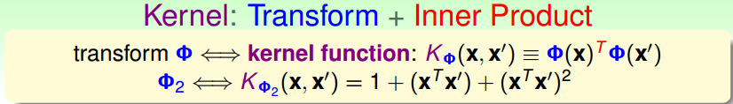

# 核支持向量机

不会吧！支持向量机还有内容？是的，本篇文章将讲解支持向量机的一个重要内容--核技巧

## 1. 动机

回顾上一篇文章--对偶支持向量机，我们说到，为了能够使计算上移除掉对特征维度d的依赖，我们引入了对偶支持向量机。它将Z空间的问题（求w,b）转换到了N空间(求an)，好像从表面上移除掉了对特征维度的依赖。但是真的完全避免了吗？我们来看看：

在对偶问题中，当我们在解决二次规划问题时，需要计算Q矩阵，从图中可以看出，在计算Q矩阵的元素的时候，需要计算Z向量的内积，由此可见，我们并没有在计算上完全避免对特征维度的依赖。

因为高维度的Z将会造成计算上的瓶颈，比如说经过Z = φ(x)的特征转换后，我的Z的维度高达30000，那如果直接计算Z的内积将会很慢。那我们有没有一种方法或者技巧，使Z内积算得快一点呢？如果存在这种更有效率的方法的话，那我们就可以说完全消除掉了对特征维度的依赖。

## 2. 核技巧

现在就需要一个方法，能够让我们在计算Z空间的内积的时候更快一点。我们就拿2次的多项式转换来作为开始。

现在如果有一个d维的特征，要将其进行二次的多项式转换，这个很简单，相当于对特征进行二次多项式的排列组合，结果如上图所示。现在如果我有两个经过了二次的多项式转换的特征要做内积，如下图，其结果如果下：

然后像图中那样做一些简单的变换，到最后我们发现，我们将Z空间的内积转换到了更低维度的X空间上了，所有的运算都基于原始的X空间，是计算更有效率。所以，如果将我们的转换和内积这两个步骤合为一个步骤，那我们的计算可能会更快。

那我们就将转换+内积这个动作去一个名字叫做kernel function：

所以一个转换就对应一个kernel function，当然这个kernel function肯定是要很容易计算的。

所以现在我们就来看看核技巧在对偶支持向量机中是怎么应用的：

* 第一个应用核技巧的地方就是二次项系数，Z空间的内积就可以用kernel function代替
* 当求出an之后，我们需要求b，计算b的时候同样需要求Z空间的内积，所以也可以用kernel function代替
* 第三个地方是我们回传的假设g(x)，w与φ(x)做内积的时候依然可以使用kernel function

所以对于我们的对偶支持向量机，现在没有任何地方在Z空间做内积。所以现在就避免了对高维空间的依赖。

### 2.1 将dual SVM 转换为kernel SVM

所以至此我们可以将dual SVM转换为kernel SVM，仅仅通过将Z空间的内积全部替换为为kernel function

所以kernel SVM将我们以前dual SVM所有牵扯到Z空间内积的地方转换为kernel function来做，这样子的话就和Z没关系了。

还有一点是kernel SVM有和dual SVM一样的优点就是我们只需要support vector就可以做对未来的预测了。

## 3. 多项式核

### 3.1 常用的二次多项式核

我们之前已经看过了一个二次多项式的核，其实在现实中，我们有很多常用的其他二次多项式的核。比如：

从上面可以看出，我们可以对我们的特征进行一些合理的放缩，这样使我们的kernel function计算起来更加方便。K2的kernel使用起来更简单，所以更常用。

当我们使用的核不一样的时候，最后形成的边界也很有可能不一样，support vector也可能不一样：

所以这里要建立一个概念就是不同的kernel可能对应不同的表现，所以就像是以前我们选择转换一样，现在我们也需要对kernel进行选择。

### 3.2 通用的多项式核

之前我们看过了二次多项式的核，我们运用相同的方法也可以推导出Q次的多项式的核：

如果说我们的多项式有Q次转换的话，就面临三个参数的选择：

* γ：伽马表示原来的X的内积做完要进行怎么的放缩
* ζ：Zeta控制的常数项还有这个多项式的系数
* Q：Q表示多项式要做几次方的转换，需要多复杂的边界

SVM配合上这些多项式的核，我们一般叫做polynomial SVM

多项式核的特殊情况：一次多项式核也就是我们的线性核，也就是不对特征进行任何转换。

## 4. 高斯核（RBF kernel）

从多项式核知道，我们可以将特征转换+内积使用kernel function表示出来，那假设现在有一种方式能够将kernel function推到极限，那是不是代表我们就可以表示无限维度的特征转换呢？这在以前的特征转换中是不可能的，因为不可能计算出无限维的特征。所以现在就引出了另一个核技巧，高斯核！

### 4.1 无限维转换的核

方便起见，我们这里只讨论一维的特征。假设有一个核定义为K(x,x') = exp(-(x-x')^2),如下图，最后我们可以推到出该核函数其实就是X转换的内积，而且这个转换还是无限多维的。推到过程如图

我们又把这种核叫做高斯核，也就是说高斯核可以实现特征的无限维转换的内积的计算。

### 4.2 高斯SVM

我们把使用了高斯核的SVM称为高斯SVM，下面我们来观察一下高斯SVM的假设函数，我们说过kernel是一个高斯函数，所以假设函数就是一个高斯函数的线性组合，且中心位于我们的support vector上面，所以假设函数就是一个中心在support vector上面的高斯函数的线性组合。因为这个特性，高斯核又通常叫做Radial Basis Function(RBF) kernel。

### 4.3 高斯SVM的实际应用

上面的章节说明了，使用了高斯kernel的SVM可以做无限维的特征转换，那现实真的这么美好吗？

如上图所示，通过设定不同的γ参数，得到了不同的结果

* γ=1：得到了比较平滑的曲线，还算不错
* γ=0：边界开始变得复杂，这应该不是想要的样子
* γ=100：明显的overfitting了

γ变大之后，标准差变小，就好像高斯函数变尖了，所以最后的结果就好像是一堆尖尖的高斯函数的线性组合。也就是说如果使用了高斯kernel，但是γ没有选择好的话，虽然有large-margin的保护，但是同样会产生overfit。

## 5. kernel的比较

我们已经介绍过了几种kernel，现在就来做一下比较，作为一个以后工作中kernel选择的参考。

### 5.1 linear kernel

首先说的是linear kernel，也就是不做任何转换。

优点：
* linear最简单，最安全，应该是首先考虑的模型
* 因为linear不涉及任何转换，所以可以直接针对SVM原始问题设计特别QP solver，使我们的计算更快
* linear具有很好的解释性，可以直接通过W会告诉每个feature的权重，SV也会告诉你那些点是重要的。

缺点：
* 因为太简单，所以是受限制的，当我们数据线性不可分的，那就没有办法做了（无解？）。

所以linear kernel通常是首先尝试的选择

### 5.2  多项式核

优点：
* 没有linear kernel的那么多限制，可以处理数据线性不可分的情况，
* 通过设定多项式转换的次数Q来表达对特征的主观想象。(比如猜测特征的关系最多是一个三次的关系)

缺点：
* 当我们的Q比较大时，会造成数值计算上的困难。如果X的内积是一个小于1的数，那再进行一个Q次方的运算的话将会得到一个十分小的数值。大于1将会变成一个很大的数字。所以说算出来的数值的范围会比较大，那这将对一般QP solver产生一定的挑战。
* 有三个参数(Q,γ，ζ)要选择，将会比较困难。

所以多项式核通常用于这种情况：我们对特征有一定的了解，特征可能是比较小的某个Q的关系。其实根据经验，如果我们的Q比较小的话，使用传统的特征转换然后使用原始SVM来解决可能会更快一些，呵呵。

### 5.3 高斯核

优点：
* 因为高斯核对应的是无限维的转换，所以它比之前的两种核都强（powerful）
* 因为高斯函数算出的值得范围是0-1之间，所以比起多项式核来说，数值计算的困难度更低以下
* 只有一个参数γ需要选择，所以比起多项式核更容易选择参数

缺点：
* 因为高斯核对应于无限多维的特征，所以不可能计算出W，所以很难通过W来解释高斯SVM做了些什么。
* 因为要解对偶问题，所以可能比linear核慢
* 如果参数选择不恰当，更容易造成过拟合

他是最常用的核技巧之一，但是要小心参数的选择

## 6. 其他的kernel

如果你想自己设计一个kernel的话，需要遵循一定的条件。

有效kernel的充分必要条件（Mercer's Condition）：

* 对称性。因为向量内积是对称的，所以你设计的也应该是对称的。
* 又一个K矩阵，K矩阵里面的每一个元素都是通过Z向量的内积算出来的，且K是半正定的。（这个不多说，这个是核函数的基本）

